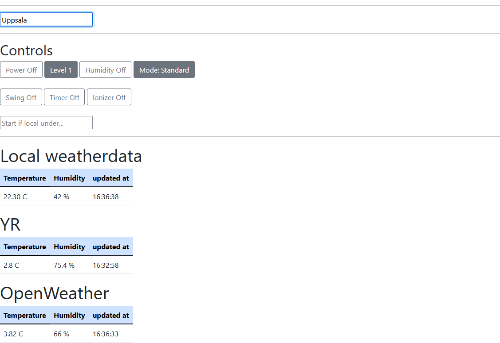

# smartify-simple-humidifier
*Gives smart control over your dumb humidifier💧*

## Overview
Project overview.
### Background
This project was born out of a want and need to automate the humidity in my room.</br>

I have eczema which gets really bad during the cold, dry months. To combat this I bought a fan/humidifier, COOL116CWT, that would cool down the room during the summer and humidify the room during the winter.</br>

The solution worked well during the summer, mostly since I left the machine on day and night, however during the winter leaving it on dayround wasn't an option. </br>

I wanted more granular control over the humidifier, with the ability to schedule depending on humidity or temperature, but the remote that came with it was quite basic and the device itself was not smart.</br>

So instead going through the pain of either buying a new humidifier with the functionallity I wanted or getting used to checking the current humidity and using the basic remote to control the device every time, I created this project.
### How does it work?
</br>

The collector sends the collected data to firebase, which acts as both database- and website- host.</br></br>
The website pulls data from the database and open weatherapis(openweatherapi and yr). These can be used to give an overview of how the humidity will rise or fall and can be taken into consideration when controlling the humidifier.</br></br>
The website can then be used to send instructions to the humidifier via the second microcontroller</br></br>
For the future of this project I want to add the ability to create and edit schedules for the humidifier based on the data collected. I also plan to add "smart" scheduling based on weather forecasts with the help of YRs forecast api. </br></br>
There could also come a point where I add machine learning to this project, but I think thats ways away and since there are open apis with forecasts out there I will stick to using these instead.</br></br>
</br></br>

## How I created this project
### Microcontrollers
I used one ESP32 to collect temperature and humidity data with a DHT11 sensor.

I chose to use the ESP32 as the collector of data since its easy to work with and I am familiar with using it. </br>
The DHT11 sensor was used since I'am also quite familiar with it and for this home project I don't need anything more accurate than what it offers.</br>

One ESP8266 to control the humidifier using an IR led.

The ESP8266 was used as the other because I had an extra lying around, if I had another ESP32 I would have used that instead.</br>
I chose to use an IR led and not to put the microcontroller directly in the machine because I didn't have enough information, no datasheet of its components, about the humidifier to ensure that installing it would be safe.</br>
### Hosting
I used firebase because firebase's features of hosting website, database, I use firestore in this project, and the ability to have stateless functions with good [interactablilty](#firebase) between the database and website intrigued me.</br> 
For this project it works well to use the free tier, since we dont need to read and write a lot with only one ESP collecting data. The project is scalable if we ever need to upgrade however.
### Apis
YR was used as apis because they usually has good accurate weather data where I live, and their api was easy to get started with.</br>
Openweatherapi was used for their ability to both get weather data and to translate a city to long lat which was needed to get data from YR.
## Using the project
How to get started using the project.
### Prerequisits
* A way of uploading code to the microcontrollers - I used Arduino IDE [guide to get started](https://dronebotworkshop.com/esp32-intro/)</br>

* [Firebase-esp](https://github.com/mobizt/Firebase-ESP-Client#installation) for connection to firebase</br>

* [Nodejs](https://nodejs.org/en/download/) and [firebase-tools](https://www.npmjs.com/package/firebase-tools?activeTab=readme) installed.</br>

* A firebase project, free tier works well for this project</br>

* An account on [openweathermap](https://openweathermap.org/api) for their api key (free)</br>


### Installation
Install the prerequisits</br>

Clone this repo
```bash
git clone https://github.com/pkoa/simple-humidifier.git
```
</br>

Add an email user in the firebase project.[add-a-user](images/add-a-user.png)</br>

Add a 'passwords.h' file in ESP8266-humidifier-handler and esp32-firebase-dht11
```C
/*	example file.*/
#define WIFI_SSID "ssid-here"
#define WIFI_PASSWORD "password-here"
#define API_KEY "firebase-project-api-key-here"
#define FIREBASE_PROJECT_ID "firebase-project-id-here"
/*	Added user from prerequisits.*/
#define USER_EMAIL "firebase-project-registered-email-here"
#define USER_PASSWORD "firebase-project-registered-password-here"
```
</br>

Create a collection in firestore called 'apikeys', add a document called 'OpenWeater' with a field 'key' where the value is a string of your apikey from openweathermap, it can take a couple of hours for them to work after you request one.</br>


To use the website connect it to your firebase account and then your firebase project. After that you can view the website using:
```bash
firebase serve
```
and go to the given localhost address, it defaults to localhost:5000</br>

Currently deploying the website breaks the controls over the humidifier, since the webserver uses http and the website gets deployed in https. If you still want to try deploying it use:
```bash
firebase deploy
```
and go to the given website, it defaults to project-name.web.app</br>

Now you are up and running!
## Example usage
If you would want to add your own code.
### Firebase
Firestore, database, example usage in javascript.
```Javascript
/*	Reading from the database.*/
firebase.firestore().collection('collection-id').doc('document-id').get(doc =>	{
	console.log(doc.data())
	/*	Do things with doc.data() here.*/
	});
```
</br>

Api handling example in javascript
```Javascript
/* Get the document.*/
fetch(`https://api.openweathermap.org/data/2.5/weather?q=${city}&appid=${apikey}&units=metric`)
.then(res => res.json())
.then(data =>{
	console.log(data)
	/*	Do things with data here*/
	})
```

### Esp32
Changing document path
```C
/*...*/

String documentPath = "collection/collection/" + String(documentName)

/*...*/
```
</br>

Sending other types of data.
```C
/*...*/

content.set("fields/dataName/dataType", variableWithData);

/*...*/
```

### Esp8266
Changing [IR codes](#Getting-IR-codes)
```C
#define POWER 0x000123
...
```

## License
The MIT License (MIT) //addmore
